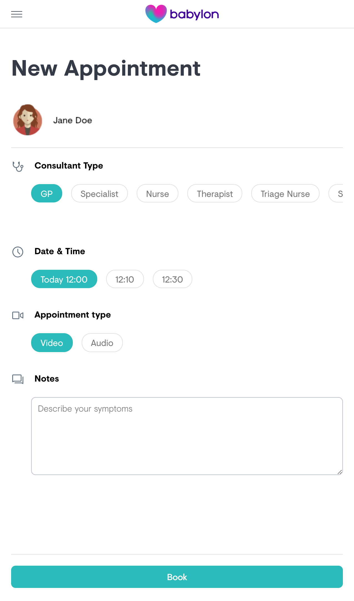

# Babylon Web technical recruitment test

Thanks for taking the time to complete our frontend coding test! You can start with forking this repository and off you go.

Good luck!

## What we are looking for

We'd like you to build an application that:

- has a sensible and maintainable structure
- is well tested
- is accessible
- looks like the designs provided (it doesn't have to be "pixel perfect")

It's helpful for us if you include some notes to explain the decisions you make.

# Instructions

We'd like you to use React. We have provided a skeleton for the React application and included [SASS](http://sass-lang.com/) for styling. We have also provided some useful constants in [constants.scss](./src/constants.scss). Feel free to add any additional libraries which you think are needed for the task.

We have also included a mock API which is documented below.

We'd like you to build one page. We've provided the design, try to make it mobile first and responsive so that it works on all viewports.

# New appointment page

### Design



### Data

You will need to use 3 API's for this page.

### `GET /users/1`

Returns a `user` object with the following info:

- `firstName`: `String` of the user's first name.
- `lastName`: `String` of the user's last name.
- `avatar`: `String` Base64 representation of the user's avatar image.
- `dateOfBirth`: `Date` The user's Date of Birth.

### `GET /availableSlots`

Returns:

- `Array` of `Date ISO 8601` that represent the available appointment slots.

### `POST /appointments`

Expects an object in the request's body with the following information:

- `userId`: `Int` The user's ID that this appointment is for.
- `dateTime`: The user's selected time slot as a `Date ISO 8601`.
- `notes`: `String` Any notes the user added when booking. _note_: not required, can be null.
- `type`: `String` The type of the appointment like `GP appointment` or `Physio appointment`.

The endpoint responds with a 200 status on success.

## Getting Started

We recommend using NVM for managing node versions on your machine.

```
brew install nvm
```

...and installing the required node version with the following command:

```
nvm install
```

This repo is using Yarn as it's package manager.

```
brew install yarn
```

Installing packages:

```
yarn install
```

```
yarn start
```
